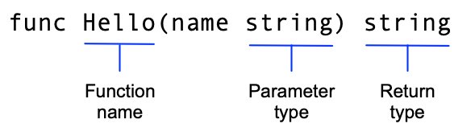

# 04-包管理

## package

一个文件夹可以称为一个包，在文件夹（包）中可以创建多个文件，每一个文件都必须有一个 package 声明,同一个目录下，go 文件 package 声明必须一致。&#x20;

这节课我们学习下，如何在 main 文件中引用另一个包中的函数：

1. 初始化项目
2. 创建一个文件夹 greetings，写入如下代码:

```go
package greetings

import "fmt"

// Hello returns a greeting for the named person.
func Hello(name string) string {
    // Return a greeting that embeds the name in a message.
    message := fmt.Sprintf("Hi, %v. Welcome!", name)
    return message
}
```

该函数接受一个类型为`string`的`name`参数。该函数还返回一个`string` 。 在Go中，名称以大写字母开头的函数可以被不在同一包中的函数调用。

<figure><figcaption></figcaption></figure>

在 Go 中， `:=`运算符是在一行中声明和初始化变量的快捷方式，等价于下面的代码：

```go
var message string
message = fmt.Sprintf("Hi, %v. Welcome!", name)
```

2. 在main 包中调用这个包的函数

将下面代码写入main 文件中:

```go
package main

import (
    "fmt"

    "awesomeProjectXX/greetings"
)

func main() {
    // Get a greeting message and print it.
    message := greetings.Hello("Gladys")
    fmt.Println(message)
}
```
