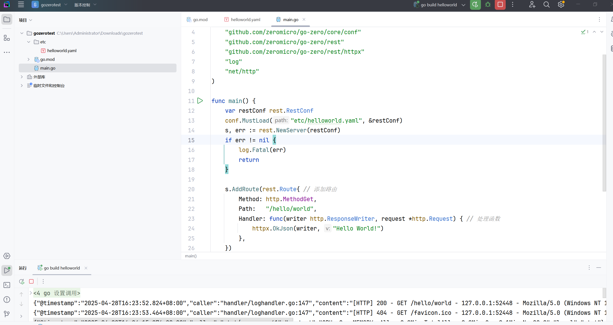
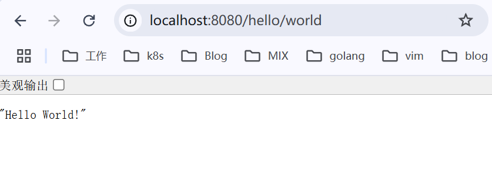

# 01-初始化服务

### 背景

之前一直是用的 b站出品的 kratos 框架来写微服务，最近开始学习 go-zero 框架，看看两个框架有什么不同。

go-zero 是一个集成了各种工程实践的 web 和 rpc 框架。通过弹性设计保障了大并发服务端的稳定性，经受了充分的实战检验。

go-zero 包含极简的 API 定义和生成工具 goctl，可以根据定义的 api 文件一键生成 Go, iOS, Android, Kotlin, Dart, TypeScript, JavaScript 代码，并可直接运行。

&#x20;使用 go-zero 的好处：

* 轻松获得支撑千万日活服务的稳定性
* 内建级联超时控制、限流、自适应熔断、自适应降载等微服务治理能力，无需配置和额外代码
* 大量微服务治理和并发工具包

<figure><figcaption></figcaption></figure>

### 前置软件安装

首先我们需要安装一些必要的软件，在[ 官网安装页面](https://go-zero.dev/docs/tasks) 按照说明依次安装  golang ， goctl，protoc，go-zero （根据你电脑系统类型选择安装方式，linux，mac，windows 都支持）。

### 初始化一个简单的 http 服务

1. 新建一个文件夹，初始化项目： go mod init  helloworld
2. 创建两个文件 etc/helloworld.yaml  main.go , 内容如下：

```yaml
Name: HelloWorld.api
Host: 127.0.0.1
Port: 8080
```

```go
package main

import (
	"github.com/zeromicro/go-zero/core/conf"
	"github.com/zeromicro/go-zero/rest"
	"github.com/zeromicro/go-zero/rest/httpx"
	"log"
	"net/http"
)

func main() {
	var restConf rest.RestConf
	conf.MustLoad("etc/helloworld.yaml", &restConf)
	s, err := rest.NewServer(restConf)
	if err != nil {
		log.Fatal(err)
		return
	}

	s.AddRoute(rest.Route{ // 添加路由
		Method: http.MethodGet,
		Path:   "/hello/world",
		Handler: func(writer http.ResponseWriter, request *http.Request) { // 处理函数
			httpx.OkJson(writer, "Hello World!")
		},
	})

	defer s.Stop()
	s.Start() // 启动服务
}

```

3. 执行 go mod tidy 下载依赖
4. 启动服务

<figure><figcaption></figcaption></figure>

5. 打开浏览器，访问接口

<figure><figcaption></figcaption></figure>
