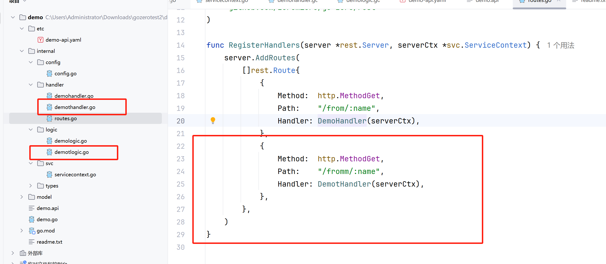

# 02-api 生成代码

上一节我们了解了如何初始化 go-zero 服务，这一节我们学习通过 api 配置文件来生成  handler ，logic ，model 等非业务的重复代码。

### 生成代码

打开 demo.api 文件，我们可以看到如下配置：

```
syntax = "v1"

type Request {
	Name string `path:"name,options=you|me"`
}

type Response {
	Message string `json:"message"`
}


service demo-api {
	@handler DemoHandler
	get /from/:name (Request) returns (Response)
}

```

这个配置文件中 service 模块定义了一个 http get 接口 ：**from/:name** ，参数和返回值定义在 Request 以及  Response 结构体中。

我们可以添加第二个接口：

```
syntax = "v1"

type Request {
	Name string `path:"name,options=you|me"`
}

type Response {
	Message string `json:"message"`
}

type Requestt {
	Name string `path:"name,options=you|me"`
}

type Responset {
	Message string `json:"message"`
}

service demo-api {
	@handler DemoHandler
	get /from/:name (Request) returns (Response)

	@handler DemotHandler
	get /fromm/:name (Requestt) returns (Responset)
}


```

然后执行下面命令生成代码：

```
goctl api go -api demo.api -dir .
```

你会发现，handler ， logic ，routes 文件里面多了代码，访问 fromm/:name 也能够返回数据。

<figure><figcaption></figcaption></figure>

### 项目框架分析

服务入口在 demo.go

```go
package main

import (
	"flag"
	"fmt"

	"demo/internal/config"
	"demo/internal/handler"
	"demo/internal/svc"

	"github.com/zeromicro/go-zero/core/conf"
	"github.com/zeromicro/go-zero/rest"
)

var configFile = flag.String("f", "etc/demo-api.yaml", "the config file")

func main() {
	flag.Parse()
	
	// 加载配置文件，配置文件在 etc/demo-api.yaml 中，定义了服务启动端口号
	var c config.Config
	conf.MustLoad(*configFile, &c)

	server := rest.MustNewServer(c.RestConf)
	defer server.Stop()
	
	// 注册路由 handlers 
	ctx := svc.NewServiceContext(c)
	handler.RegisterHandlers(server, ctx)
	
	// 启动服务
	fmt.Printf("Starting server at %s:%d...\n", c.Host, c.Port)
	server.Start()
}

```

handler 目录下有 routes.go 和 demohandler.go，route 负责将路由匹配对应的 handler，由于我们在 demo.api 中定义了两个，这里也会生成2个

<figure><figcaption></figcaption></figure>

handler 负责解析请求，返回响应，具体业务写在 logic 中

<figure><figcaption></figcaption></figure>


demologic.go 文件的 demo 方法里面有个 todo 注解，业务代码包括操作数据库的代码可以写在这里，通过 api 生成代码的方式，可以让我们少些很多代码。

如果你熟悉 java spring 框架，会发现 java 通过注解方式少写代码，go通过代码生成方式少些代码，本人更加喜欢生成代码方式。

<figure><figcaption></figcaption></figure>
