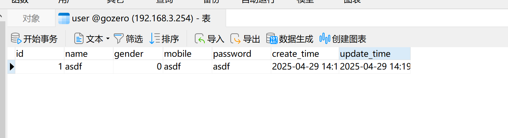

# 03-连接 mysql

### 一、前言

go-zero 是一款高效、易用的微服务框架，其内置的代码生成工具 `goctl` 能大幅提升开发效率。本教程将详细讲解如何在 go-zero 项目中集成 MySQL 数据库。

### 二、环境准备

1. **安装依赖工具**
   * **Go 1.16+**:&#x20;
   *   **MySQL 5.7+**: 推荐使用 Docker 快速部署：

       bashCopyDownload

       ```
       docker run --name mysql -e MYSQL_ROOT_PASSWORD=123456 -p 3306:3306 -d mysql:8.0
       ```
   *   **go-zero 工具链**:

       bashCopyDownload

       ```
       go install github.com/zeromicro/go-zero/tools/goctl@latest
       ```
2. 创建示例数据库

```sql
CREATE TABLE `user` (
                        `id` bigint unsigned NOT NULL AUTO_INCREMENT,
                        `name` varchar(255)  NOT NULL DEFAULT '' COMMENT '用户姓名',
                        `gender` tinyint(3) unsigned NOT NULL DEFAULT '0' COMMENT '用户性别',
                        `mobile` varchar(255)  NOT NULL DEFAULT '' COMMENT '用户电话',
                        `password` varchar(255)  NOT NULL DEFAULT '' COMMENT '用户密码',
                        `create_time` timestamp NULL DEFAULT CURRENT_TIMESTAMP,
                        `update_time` timestamp NULL DEFAULT CURRENT_TIMESTAMP ON UPDATE CURRENT_TIMESTAMP,
                        PRIMARY KEY (`id`),
                        UNIQUE KEY `idx_mobile_unique` (`mobile`)
) ENGINE=InnoDB  DEFAULT CHARSET=utf8mb4;
```

### 三、配置mysql 数据源

1.  **修改项目配置文件**\
    在 `etc/demo-api.yaml` 中添加 MySQL 配置：

    ```
    Name: demo-api
    Host: 0.0.0.0
    Port: 8888
    Mysql:
      DataSource: root:123456@tcp(localhost:3306)/demo?charset=utf8mb4&parseTime=true
    ```
2.  **解析配置结构体**\
    在 `internal/config/config.go` 中定义配置：

    ```go
    package config

    import "github.com/zeromicro/go-zero/rest"

    type Config struct {
        rest.RestConf
        Mysql struct {
            DataSource string
        }
    }
    ```

### 四、生成模型代码

mysql 代码生成支持从 sql 文件和数据库链接生成， 且支持生成带缓存逻辑代码。mysql 生成的代码内容有数据表对应的 golang 结构体、CURD 操作方法，缓存逻辑等信息。**本文我们体验下从 sql 文件生成 go代码。**

新建 model 文件夹，创建一个 user.sql 文件，放入 sql 建表语句：

```sql
CREATE TABLE `user` (
                        `id` bigint unsigned NOT NULL AUTO_INCREMENT,
                        `name` varchar(255)  NOT NULL DEFAULT '' COMMENT '用户姓名',
                        `gender` tinyint(3) unsigned NOT NULL DEFAULT '0' COMMENT '用户性别',
                        `mobile` varchar(255)  NOT NULL DEFAULT '' COMMENT '用户电话',
                        `password` varchar(255)  NOT NULL DEFAULT '' COMMENT '用户密码',
                        `create_time` timestamp NULL DEFAULT CURRENT_TIMESTAMP,
                        `update_time` timestamp NULL DEFAULT CURRENT_TIMESTAMP ON UPDATE CURRENT_TIMESTAMP,
                        PRIMARY KEY (`id`),
                        UNIQUE KEY `idx_mobile_unique` (`mobile`)
) ENGINE=InnoDB  DEFAULT CHARSET=utf8mb4;
```

使用 `goctl` 自动生成数据库操作代码，大幅减少手写 SQL 的工作量：

```
goctl model mysql ddl -src .\model\user.sql -dir .\model
```

生成后的代码结构如下：

```
model/
├── user.sql
├── usermodel.go     # 自动生成的 CRUD 方法
|---usermodel_gen.go
└── vars.go          # 数据库连接配置
```

1.  **查询单条数据**\
    在 `logic` 层调用生成的 `UserModel`：


    ```go
    // logic/getuserlogic.go
    func (l *GetUserLogic) GetUser(req *types.GetUserReq) (*types.UserResp, error) {
        user, err := l.svcCtx.UserModel.FindOne(l.ctx, req.Id)
        if err != nil {
            return nil, errors.New("用户不存在")
        }
        return &types.UserResp{
            Id:   user.Id,
            Name: user.Name,
            Age:  user.Age,
        }, nil
    }
    ```
2.  **插入数据**


    ```go
    func (l *CreateUserLogic) CreateUser(req *types.CreateUserReq) error {
        _, err := l.svcCtx.UserModel.Insert(l.ctx, &model.User{
            Name: req.Name,
            Age:  req.Age,
        })
        return err
    }
    ```

**五、实现 CRUD 操作**

1. **修改 svc/servicecontext.go 文件，添加用户模型**

```go
package svc

import (
    "demo/internal/config"
    "demo/model"
    "github.com/zeromicro/go-zero/core/stores/sqlx"
)

type ServiceContext struct {
    Config config.Config

    UserModel model.UserModel
}

func NewServiceContext(c config.Config) *ServiceContext {
    conn := sqlx.NewMysql(c.Mysql.DataSource)
    return &ServiceContext{
       Config:    c,
       UserModel: model.NewUserModel(conn, nil),
    }
}
```

&#x20;

2. **插入单条数据,在 `logic` 层调用生成的 `UserModel`：**

```go
// logic/demologic.go
func (l *DemoLogic) Demo(req *types.Request) (resp *types.Response, err error) {
	// todo: add your logic here and delete this line
	resp = new(types.Response)
	resp.Message = req.Name

	u := &model.User{
		Name:     "asdf",
		Gender:   0,
		Mobile:   "asdf",
		Password: "asdf",
	}
	l.svcCtx.UserModel.Insert(context.Background(), u)
	return resp, nil
}

```

### 六、运行代码

执行 go mod tidy ，下载 mysql 相关依赖，打开浏览器，输入接口地址进行测试，查看 mysql 数据库中是否成功插入一条数据：

<figure><figcaption></figcaption></figure>

本教程代码地址： [https://github.com/mouuii/go-zero-tutorial](https://github.com/mouuii/go-zero-tutorial)&#x20;

commit：084269e1e0e9e6b3871ca717704a8364e526b325\
